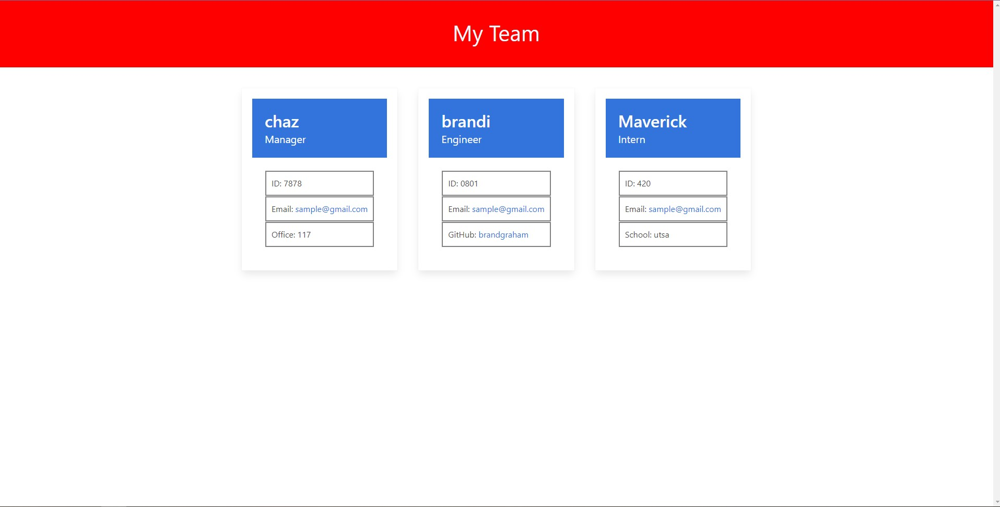

# Chazs Team Profile Generator

## Descripton
This is an application the uses inquire to dynamically generate an Html file that has your Team members profile information.
Here is DEMO video https://drive.google.com/file/d/1cX93qIOkUpylZtGZeycv69xJdGWZszHY/view

## Table of Contents
  * [Installation Instructions](#installation-instructions)
  * [Application Usage](#application-usage)
  * [Contributors](#contributors)
  * [Licenses](#licenses)
  * [Tests](#tests)
  * [Contact Me](#contact-me)

## Installation Instructions
Before running this application you must install -you will need npm i inquirer@8.2.4 as well as jest for testing purposes.

## Application Usage
-To create a team with each members profile.

## Contributors
By Chaz Graham

## Licenses
This application is licensed under: None

## Tests
To test application open the console and run the following comand: npm test Engineer, npm test Intern, npm test Manager, npm test TeamMember.

## Contact Me
If you have additional questions you can contact me at https://github.com/chazgraham